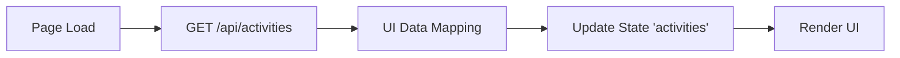
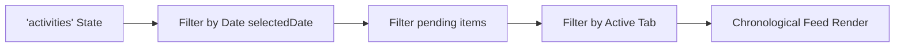
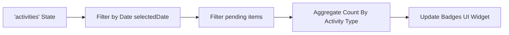
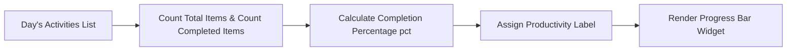
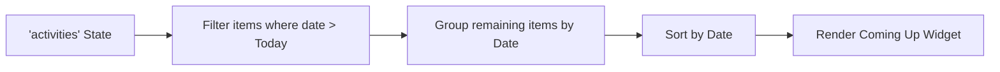
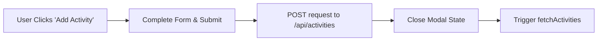
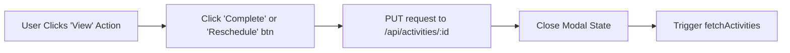
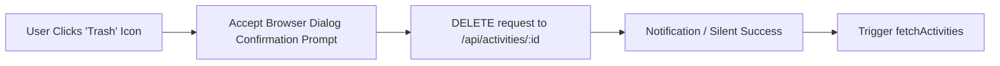

# Activity Module Analysis - UI Elements and Data Flow

Based on the structure of your provided PDF document, here is a breakdown of the elements and data flows present in your `activity` page (e:\work\Automation\CRM\Tagverse_crm\Tagverse_crm\src\app\(crm)\activity\page.tsx):

## UI Elements Analysis

### 1. Top Section: Day Header Banner & Badges
- **Date Header**: Shows selected date with an integrated calendar date picker ("TODAY'S SCHEDULE").
- **Overview Count Badges (KPIs)**: Gives a quick count of pending items for the selected date.
  - **Meetings**: Number of pending meeting activities (Blue Video icon).
  - **Tasks**: Number of pending task activities (Amber CheckSquare icon).
  - **Deadlines**: Number of pending deadline activities (Rose AlertTriangle icon).

### 2. Left Section: Main Timeline & Filters
- **Filters Card**: Tabs to quickly filter the timeline feed ('All', 'Meetings', 'Tasks', 'Deadlines', 'Followups').
- **Chronological Feed (Active Timeline)**: 
  - **Activity Item**: Displays time, specific icon (based on type), Activity Title, Company Tag, Duration, Priority Badge, and inline action buttons (Delete, View).
- **Add Activity Button**: Opens a modal to schedule a new activity.
- **Completed Section**: An expandable accordion ("Completed Today") showing closed workflows for the day.

### 3. Right Section: Insights & Upcoming
- **Coming Up Widget**: A list of upcoming events beyond the selected date, grouped by day (e.g., "Tomorrow"). Shows colored event dots, title, time, and owner.
- **Productivity Tracker**: A progress widget showing how many activities were completed vs total for the day. Includes a visual progress bar and dynamic motivation labels (e.g., "On Track", "Perfect Day").

## Data Flow Diagrams (Mermaid)

### 1. Activity Initialization & Fetching

### 2. Filter & Timeline Rendering

### 3. Overview Badges (Meetings, Tasks, Deadlines)

### 4. Productivity Tracker (Completion Progress)

### 5. Coming Up (Future Events)

### 6. Add New Activity

### 7. Complete / Reschedule Activity

### 8. Delete Activity

