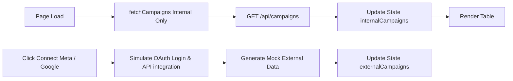
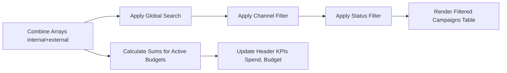
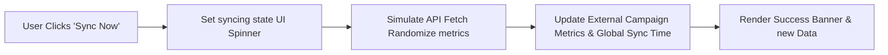
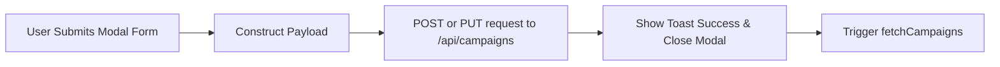
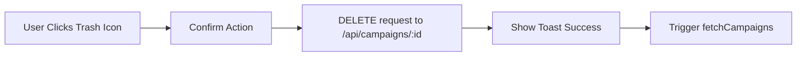

# Campaigns Module Analysis - UI Elements and Data Flow

Based on the structure of your provided campaigns module code (e:\work\Automation\CRM\Tagverse_crm\Tagverse_crm\src\app\(crm)\campaigns\page.tsx), here is a breakdown of the elements and data flows present in the page:

## UI Elements Analysis

### 1. Top Section (Header & KPIs)
- **Title Area**: "Ad-Suite Campaigns" with an 'Enterprise' badge and descriptive subtitle.
- **KPI Overview**:
  - **Total Portfolio Spend**: Aggregated spend across all channels.
  - **Active Budget**: Sum of budgets for 'Active' status campaigns only.
  - **Connected Channels**: Visual indicator of active integrations (Meta, Google, Internal), showing lit/dim icons based on connection state.

### 2. Action Bar & Filtering
- **Policy Banner**: A "Raw Metrics Protection Policy" warning that explains external metrics are read-only.
- **Primary Actions**:
  - **'+ New Campaign'**: Opens modal to create a new internal campaign.
  - **'Connect Meta Ads' / 'Connect Google Ads'**: Simulates OAuth integration and populates external mock data.
  - **'Sync Now'**: Triggers a manual data refresh with a spinning icon and updates the 'Sync Status' timestamp.
- **Advanced Filters**:
  - Global Search (by Campaign Name or ID)
  - Channel Filter Dropdown (All, Internal, Meta, Google)
  - Status Filter Dropdown (All, Active, Paused, Draft)

### 3. Data Table (Campaigns List)
- **Campaigns Table**: A comprehensive view of both internal and external campaigns.
  - **Columns**: Campaign Info (Name, ID, Last Synced text), Source (Platform badge), Status (Active/Paused/Draft with colored dots), Active Budget, Synced Spend (includes a visual progress bar indicating percentage spent), Impressions, Clicks (with computed CTR), and Actions.
  - **External Row Actions**: Read-only "View Stats" button with a lock icon.
  - **Internal Row Actions**: "Edit" and "Delete" buttons.

### 4. Modals & Overlays
- **Create / Edit Modal (Internal Only)**: Form fields to manage internal campaigns, including Campaign Name, Channel (Email/Social/Paid/Content), Status, Monthly Allocated Budget, Start Date, and End Date.
- **Notification System**: 
  - Sync Success Banner (Sticky top banner appearing after manual sync).
  - Toast Notification (Bottom right popup for Create/Edit/Delete actions).

## Data Flow Diagrams (Mermaid)

### 1. Data Initialization & Provider Connection

### 2. Dynamic Filtering & Aggregation

### 3. Manual Sync (External Metrics)

### 4. Create / Edit Internal Campaign

### 5. Delete Internal Campaign

