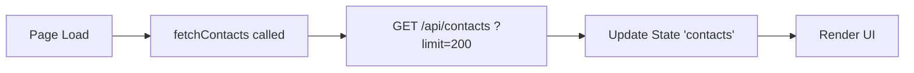
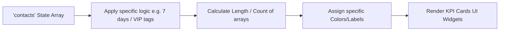
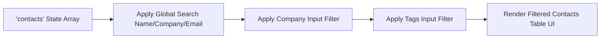
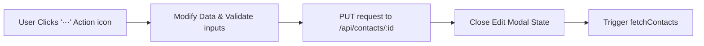
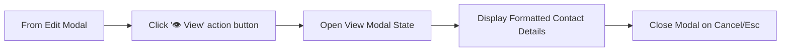
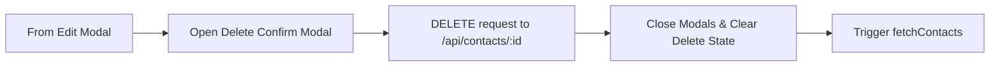

# Contacts Module Analysis - UI Elements and Data Flow

Based on the structure of your provided contacts module code (e:\work\Automation\CRM\Tagverse_crm\Tagverse_crm\src\app\(crm)\contacts\page.tsx), here is a breakdown of the elements and data flows present in the page:

## UI Elements Analysis

### 1. Top Section: KPI Cards
- **KPI Grid**: A 4-column overview of contact metrics.
  - **Total Contacts**: Overall count of fetched contacts.
  - **Recently Added**: Count of contacts added in the last 7 days.
  - **Key Accounts**: Count of contacts possessing 'VIP' or 'Decision Maker' tags.
  - **Engaged**: Count of contacts with a recent interaction (lastContactAt).

### 2. Middle Section: Filters & Actions
- **Global Search**: Main input field for searching Name, Company, or Email.
- **Advanced Filters**:
  - **Filter Company**: Text input to narrow down by company.
  - **Filter Tags**: Text input to narrow down by specific tags.
  - **Clear Button**: Appears dynamically when any filter is active, instantly resetting search states.

### 3. Bottom Section: Data Table
- **Contacts Table**: A tabular view of filtered contacts displaying Name, Company, Email, Phone, Tags (pill format), Added (Date), and an Actions menu (⋯).

### 4. Modals / Overlays
- **Contact Modal (Edit)**: An overlay form for editing contact details. Includes fields for Full Name, Email, Phone, Company, and Tags (comma-separated).
- **View Modal**: A read-only overlay showing a clean summary of the contact's core details (Phone, Email, Owner, Tags, Added, Last Contact).
- **Delete Confirm Modal**: A safety prompt to confirm the deletion action.

## Data Flow Diagrams (Mermaid)

### 1. Contacts Initialization & Fetching

### 2. KPI Cards Calculation

### 3. Dynamic Filtering & Table Rendering

### 4. Edit Existing Contact

### 5. View Contact Details

### 6. Delete Contact

