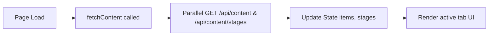
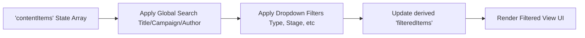
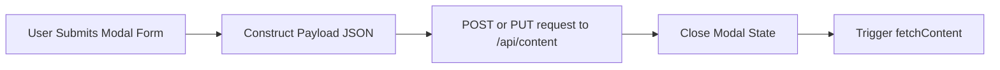
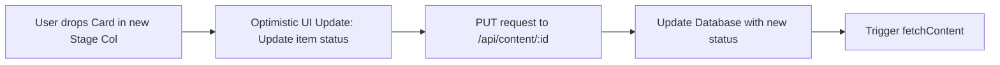
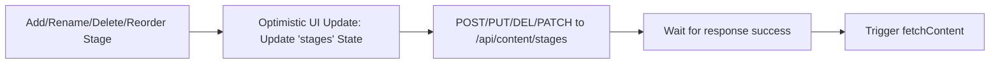
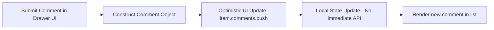
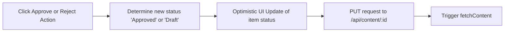

# Content Module Analysis - UI Elements and Data Flow

Based on the structure of your provided content module code (e:\work\Automation\CRM\Tagverse_crm\Tagverse_crm\src\app\(crm)\content\page.tsx), here is a breakdown of the elements and data flows present in the page:

## UI Elements Analysis

### 1. Top Section (Header)
- **Title & Subtitle**: "Content Hub" with a brief description.
- **View Tabs (Segmented Control)**: 
  - **Pipeline**: Kanban board view.
  - **Library**: Tabular list view.
  - **Approvals**: Awaiting sign-off view (features a badge indicating the number of items 'In Review').
- **Primary CTA**: "+ New Content" button to trigger the creation modal.

### 2. Pipeline View (Kanban)
- **Filters Row**: Global search input, Campaign filter dropdown, and a drag-and-drop hint.
- **Kanban Board**: Horizontal scrollable area representing content lifecycle stages.
  - **Column Headers**: Draggable (for reordering), showing the stage name, a colored dot, item count, and hover actions (Rename/Delete).
  - **Content Cards**: Draggable items showing Type badge, Title, Campaign, Author initials, Due date, left/right move chevron buttons, and a Delete action. Clicking a card opens the Detail Drawer.
  - **Inline Actions**: "+ Add Content" button at the bottom of each column, and "+ Add Column" on the far right to create new stages.

### 3. Library View (Table)
- **Filters Bar**: Comprehensive filtering including Global Search, Content Type, Status/Stage, Funnel Stage, Target Persona, and a Clear Filters button.
- **Content Table**: A data table with columns for Title (and ID), Type, Campaign/Strategy, Status (with colored dot), Owner & Due Date, and Actions (Edit/Delete).

### 4. Approvals View
- **Workflow Lifecycle Widget**: A visual step-by-step indicator showing the 4 stages of content creation (Ideation, Manager Review, Approval, Schedule).
- **Pending Approvals List**: Displays only items currently in the 'In Review' status.
  - Each card shows Type, Campaign, Title, Due Date, Description, Creator, and primary action buttons to "Send back to Draft" (Reject) or "Approve Asset" (Approve).

### 5. Modals & Drawers
- **Create/Edit Modal**: Form fields for Content Title, Type, Campaign, Priority, Stage, and Description/Brief.
- **Detail Drawer**: A right-side slide-in panel showing detailed information of a selected item.
  - Tabs: 'Metadata' (Campaign, Persona, Status, etc.), 'Comments' (Collaboration feed + input to add a comment), and 'History' (Timeline of actions).
  - Footer Actions: Edit/Close buttons, or Reject/Approve buttons if the item is in review.

## Data Flow Diagrams (Mermaid)

### 1. Data Initialization (Content & Stages)

### 2. Dynamic Filtering (Library & Pipeline)

### 3. Create / Edit Content

### 4. Drag-and-Drop Card Movement (Pipeline)

### 5. Stage (Column) Management

### 6. Collaboration (Adding Comments)

### 7. Approvals Workflow

