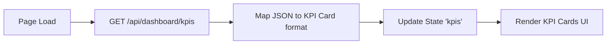
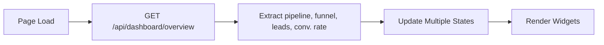
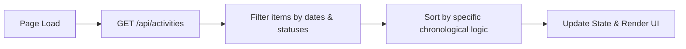
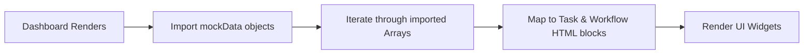

# Dashboard Module Analysis - UI Elements and Data Flow

Based on the structure of your provided dashboard module code (e:\work\Automation\CRM\Tagverse_crm\Tagverse_crm\src\app\(crm)\dashboard\page.tsx), here is a breakdown of the elements and data flows present in the page:

## UI Elements Analysis

### 1. Top Section: KPI Cards (Key Performance Indicators)
- **KPI Grid**: A 5-column grid showing critical business metrics. Each card contains:
  - **Label** (e.g., Total Leads, Monthly Revenue)
  - **Value** (Formatted numbers, e.g., ₹0, 34.2%)
  - **Trend & Delta** (e.g., ↑ All time, ↓ Needs attention)
  - **Themed Icon & Color**

### 2. Middle Section: Pipeline & Funnel
- **Deal Pipeline (Kanban Board)**: A horizontal layout of pipeline stages. Each column displays its stage name, deal count, and Deal Cards (Name, Company, Value, Owner). Includes a skeleton loader while fetching.
- **Conversion Funnel**: A visual representation of lead drop-offs. Displays stage names, horizontal percentage fill bars, counts, and a prominent Overall Conversion Rate metric at the bottom.

### 3. Bottom Section: Details, Activity & Integrations
- **Recent Leads**: A tabular view of the newest leads showing Name, Company, Source, Stage badge, Score (color-coded), Owner initial avatar, and relative Time.
- **Activity Feed**: A live list of chronological activities filtered to show today's events, yesterday's unfinished items, and tomorrow's scheduled events. Features colored dots by type, title, context (contact/deal), and relative timestamps.
- **Urgent Tasks**: A to-do list widget displaying assigned tasks with Title, Priority badge (High/Medium/Low), Due time, and Owner avatar.
- **Automation Hub (n8n)**: A grid showing live statuses of background workflows. Each card shows the workflow name, total run count, and last run time, alongside an "All systems operational" status indicator.

## Data Flow Diagrams (Mermaid)

### 1. KPI Data Fetching

### 2. Pipeline, Funnel & Recent Leads Fetching

### 3. Activity Feed Fetching & Filtering

### 4. Static/Mock Data Widgets (Tasks & n8n)

