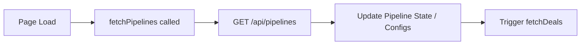
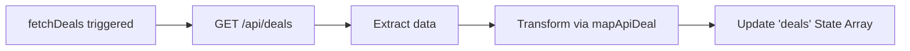
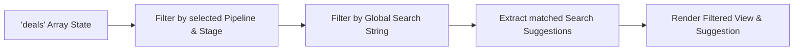
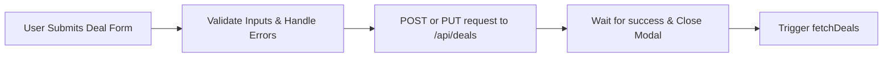
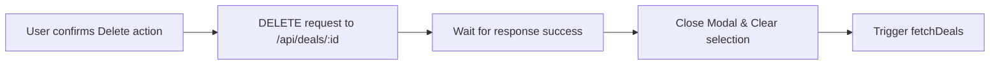

# Deals Module Analysis - UI Elements and Data Flow

Based on the structure of your provided deals module code (e:\work\Automation\CRM\Tagverse_crm\Tagverse_crm\src\app\(crm)\deals\page.tsx), here is a breakdown of the elements and data flows present in the page:

## UI Elements Analysis

### 1. Top Navigation Bar
- **Pipeline Selector Dropdown**: A custom dropdown menu to switch the active pipeline context (includes an "All Deals" option).
- **Global Search Bar**: A smart search input (with ⌘K hint) that features a real-time auto-suggest dropdown categorizing results by Deal, Client, or Tag.
- **Notification Icon**: A bell icon with an unread badge that toggles the Notification Drawer.
- **Help Icon**: Toggles the Help & Resources modal.
- **User Profile Dropdown**: Displays user avatar/info and expands to show account settings and logout options.

### 2. KPI Cards
- A 4-column overview grid:
  - **Total Pipeline Value**: Formatted currency sum of open deals.
  - **Won Value (This Month)**: Formatted currency sum of won deals.
  - **Win Rate %**: Calculation based on closed deals.
  - **Deals Needing Follow-up**: Count of deals with immediate action required.

### 3. View Toggle & Filters
- **View Toggle**: Segmented control to switch between '≡ List' and '⬡ Kanban' layouts.
- **Stage Filter Pills**: Clickable pill buttons to quickly filter deals by their specific stage (All, new, engaged, qualified, etc.).
- **Primary CTA**: "+ New Deal" button to trigger the deal creation modal.

### 4. Data Views (List & Kanban)
- **List View**: A comprehensive data table displaying Deal Name, Client, Value, Stage badge, Tags, Probability (with visual progress bar), Days in stage, Follow-up status, Owner, Source, and Actions menu (⋯). Search matches are visually highlighted in yellow.
- **Kanban View**: A horizontal board of stages. Each stage acts as a column containing basic Deal Cards and a "+ Add Deal" button at the bottom.

### 5. Drawers & Modals
- **Deal Form Modal (Create/Edit)**: A highly detailed form including Deal Name, Client, Value, Pipeline/Stage dropdowns, a dynamic Probability range slider, Source, Tags, Owner, Date fields, and Notes.
- **View Deal Detail Drawer**: A right-side slide-in panel showing comprehensive, read-only details of a selected deal, including a prominent value banner and probability bar.
- **Notification Drawer**: A right-side slide-in panel showing a feed of recent alerts.
- **Help Panel**: A modal dialog containing a list of support resources and links.
- **Delete Confirm Modal**: A safety prompt to confirm the deletion of a deal.

## Data Flow Diagrams (Mermaid)

### 1. Page Initialization (Pipelines & Deals)

### 2. Deals Fetching & Transformation

### 3. Client-Side Search & Filtering

### 4. Create / Edit Deal Submission

### 5. Delete Deal

