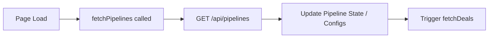
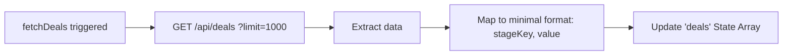
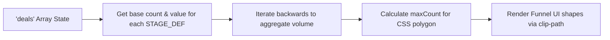
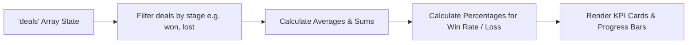

# Funnel Module Analysis - UI Elements and Data Flow

Based on the structure of your provided funnel module code (e:\work\Automation\CRM\Tagverse_crm\Tagverse_crm\src\app\(crm)\funnel\page.tsx), here is a breakdown of the elements and data flows present in the page:

## UI Elements Analysis

### 1. Top Section: KPI Cards
- A 4-column grid of key performance metrics:
  - **Total Deals**: The overall count of deals in the selected pipeline.
  - **Conversion Rate**: The percentage of deals that reached the 'won' stage.
  - **Avg. Deal Value**: The calculated average deal size.
  - **Lost Value**: The total monetary value of deals in the 'lost' stage.

### 2. Left Area: Funnel Visualization & Metrics
- **Funnel Header**: Contains a Pipeline Selector Dropdown to switch contexts and a badge showing the Total Deals count.
- **Interactive Funnel Chart**: A CSS clip-path based visual funnel.
  - The funnel aggregates deal volume downwards (i.e., 'new' stage includes 'engaged', 'qualified', etc.).
  - Hover interactions: Hovering over a stage expands it (scales up slightly) and reveals detailed information including the stage label, formatted value, and conversion rate relative to the preceding stage.
- **Stage Performance Metrics Table**: A clean tabular view beneath the funnel showing Stage Name, Deal Volume (count), and Stage Value.

### 3. Right Area: Win/Loss Ratio
- **Win/Loss Ratio Card**: A summary card displaying the proportion of deals in different lifecycle phases (All Time).
  - Shows percentages for 'Won Deals', 'Lost Deals', and 'In Progress'.
  - Uses colored horizontal progress bars for quick visual comparison.

## Data Flow Diagrams (Mermaid)

### 1. Data Initialization (Pipelines & Deals)

### 2. Deals Fetching & Transformation

### 3. Funnel Aggregation Calculation

### 4. KPI & Ratio Calculations

