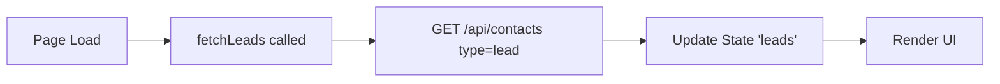
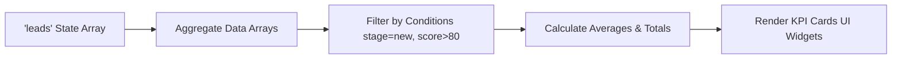
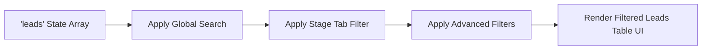
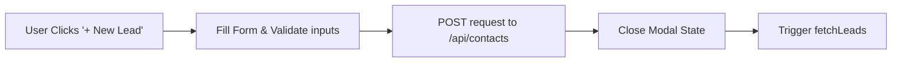
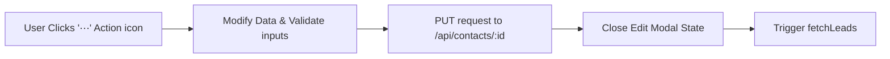
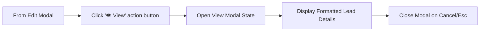
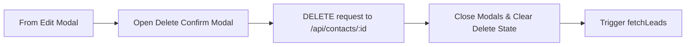

# Leads Module Analysis - UI Elements and Data Flow

Based on the structure of your provided leads module code (e:\work\Automation\CRM\Tagverse_crm\Tagverse_crm\src\app\(crm)\leads\page.tsx), here is a breakdown of the elements and data flows present in the page:

## UI Elements Analysis

### 1. Top Section: KPI Cards (Key Performance Indicators)
- **Overview KPI Cards**: Gives a quick aggregation of lead data.
  - **Total Leads**: Count of all fetched leads.
  - **New This Week**: Count of leads with the stage marked as 'new'.
  - **Hot Leads**: Count of leads with a lead score ≥ 80.
  - **Avg. Lead Score**: Calculated average of all lead scores.

### 2. Middle Section: Filters & Actions
- **Global Search**: Text input for searching leads by Name or Company.
- **Primary Stage Tabs**: Segmented control for quick filtering by primary stages ('All', 'New', 'Engaged', 'Qualified', etc.).
- **'+ New Lead' Button**: Opens the Add Lead Modal.
- **Advanced Filters Bar**: 
  - Filter Company (Text input)
  - Filter Sources (Dropdown)
  - Filter Stages (Dropdown)
  - Filter Tags (Text input)
  - Filter WA (Dropdown for WhatsApp active/inactive)
  - Clear Button (Resets all filters/search states)

### 3. Bottom Section: Data Table
- **Leads Table**: Tabular display of filtered leads. Columns include Name, Company, Email, Phone, Source, Tags (intent pills), Stage (status badge), Score (visual progress bar & number), WA (status dot), Added (Date), and an Actions menu (⋯).

### 4. Modals / Overlays
- **Lead Modal (Shared)**: A shared form component for both Adding and Editing leads. Contains fields for Name, Company, Phone, Email, Source, Stage, Tags, Lead Score (range slider), and WhatsApp Active (checkbox).
- **View Modal**: A read-only overlay showing detailed information about a selected lead.
- **Delete Confirm Modal**: A confirmation prompt to prevent accidental deletions.

## Data Flow Diagrams (Mermaid)

### 1. Leads Initialization & Fetching

### 2. KPI Cards Calculation

### 3. Dynamic Filtering & Table Rendering

### 4. Add New Lead

### 5. Edit Existing Lead

### 6. View Lead Details

### 7. Delete Lead

