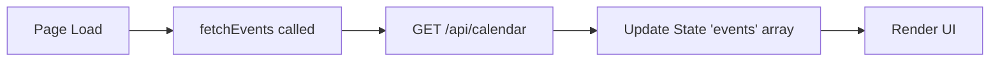
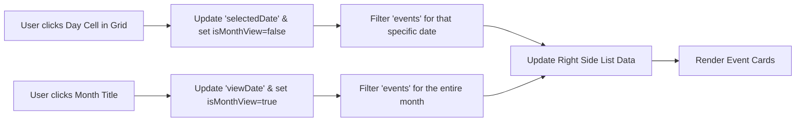
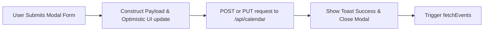
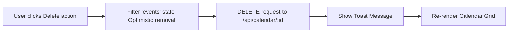
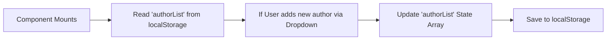

# Marketing Calendar Module Analysis - UI Elements and Data Flow

Based on the structure of your provided marketing-calendar module code (e:\work\Automation\CRM\Tagverse_crm\Tagverse_crm\src\app\(crm)\marketing-calendar\page.tsx), here is a breakdown of the elements and data flows present in the page:

## UI Elements Analysis

### 1. Top Section (Header)
- **Title Area**: "Scheduling Calendar" with an icon and descriptive subtitle.
- **Primary Action**: '+ Schedule Post' button, which opens the creation modal.

### 2. Split Calendar View (Grid + Side List)
- **Left Side - Calendar Grid**:
  - **Month Navigation**: Left/Right chevrons to navigate months. The month title is clickable to toggle a 'Month View' in the side list.
  - **Day Cells**: A 7-column grid displaying the days of the month. Cells show colored bar indicators representing scheduled events. The currently selected day is highlighted.
- **Right Side - Event List**:
  - **Context Header**: Displays either the specific selected date or the entire month, alongside an event count and a quick '+' add button.
  - **Event Cards**: Lists events corresponding to the selection. Cards display channel badge, status (Scheduled/Published), title, time, and author. On hover, Edit and Delete actions appear.

### 3. Upcoming Scheduled Table
- **Bottom Section**: A comprehensive data table for "All Upcoming Scheduled" events.
- **Table Columns**: Company/Client, Content Title, Channel (badge), Scheduled For (Date & Time), Author, Status, and an Actions menu (ellipsis dropdown containing View, Edit, Delete).
- **Interactivity**: Clicking a row opens the 'Event Details' modal.

### 4. Modals & Notifications
- **Schedule / Edit Post Modal**: A form to add or modify an event. Fields include Post Title, Company, Client, Channel, Color Label picker, Date, Time, and an advanced Author dropdown (allowing addition of new authors).
- **Event Details Modal (View)**: A detailed read-only popup showing metadata (Date, Time, Channel, Status, Assignee profile). Includes footer actions to 'Delete Post', 'Mark as Published', or 'Reschedule' (Edit).
- **Toast Notification**: A floating popup in the bottom right for success/error feedback (e.g., "Post scheduled successfully!").

## Data Flow Diagrams (Mermaid)

### 1. Calendar Initialization & Fetching

### 2. Calendar Navigation & Filtering

### 3. Schedule / Edit Event

### 4. Event Deletion

### 5. Author Management (Local State)

