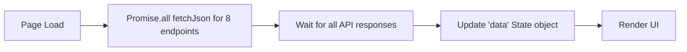
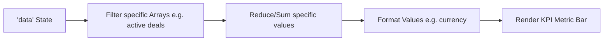
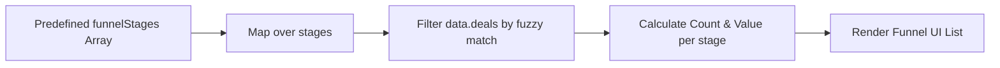
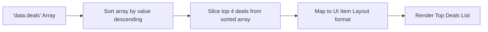

# Overview Module Analysis - UI Elements and Data Flow

Based on the structure of your provided overview module code (e:\work\Automation\CRM\Tagverse_crm\Tagverse_crm\src\app\(crm)\overview\page.tsx), here is a breakdown of the elements and data flows present in the page:

## UI Elements Analysis

### 1. Section A: KPI Metric Bar
- A 4-column grid showing high-level aggregated metrics:
  - **Active Deals**: Count, percentage change, and Briefcase icon.
  - **Pipeline Value**: Formatted currency total, growth change, and Dollar sign icon.
  - **Open Tasks Today**: Count of pending tasks, remaining work status, and CheckSquare icon.
  - **Active Campaigns**: Count of active campaigns, ROI status, and Megaphone icon.

### 2. Section B: Company Snapshot Cards
- **Portfolio & Stage Coverage**: A horizontally scrolling container for company profiles.
- **Company Card**: Includes Logo, Name, Industry, Stage badge (e.g., Closed Won, Lead), Pipeline Value, and a visual Health percentage progress bar.

### 3. Section C: Pipeline Funnel & Top Deals (2 Column Grid)
- **Pipeline Progression (Funnel)**: A stacked list representation of the funnel stages. Displays stage index, stage name, count of companies, and total value in that stage.
- **Top Weighted Deals**: A ranked list of the highest value deals (top 4). Shows Rank # avatar, Title, Company Name badge, Stage, Value, and Expected Close date.

### 4. Section D: Marketing Campaigns & Recent Assets
- **Marketing Campaigns**: List of up to 4 recent campaigns showing Megaphone avatar, Name, Channel, Start Date, formatted Spent amount, and Status (Active/Inactive).
- **Recent Assets**: List of up to 4 items from the Content Hub showing File avatar, Title, Size, and Upload Date.

### 5. Section E: Finance & Team Activity
- **Financials & Contracts**: A mixed list displaying both pending/overdue invoices and active contracts. Shows Client, ID, Status, Amount/Value per year, and Due/End date.
- **Team Activity Log**: List of recent cross-workspace activities showing a colored dot, Title/User description, specific metadata (Value/Campaign), and relative time.

## Data Flow Diagrams (Mermaid)

### 1. Parallel Data Fetching & Initialization

*(APIs fetched: deals, campaigns, tasks, companies, invoices, contracts, activities, content)*

### 2. KPI Pre-calculation

### 3. Pipeline Funnel Calculation

### 4. Top Deals Sorting

