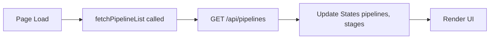
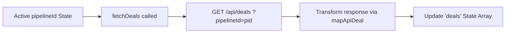
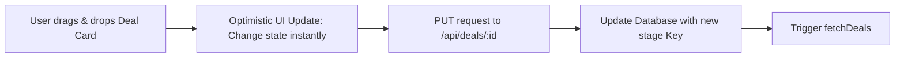
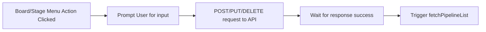
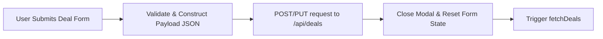
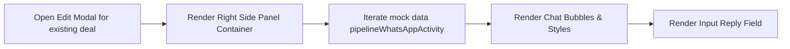

# Pipeline Module Analysis - UI Elements and Data Flow

Based on the structure of your provided pipeline module code (e:\work\Automation\CRM\Tagverse_crm\Tagverse_crm\src\app\(crm)\pipeline\page.tsx), here is a breakdown of the elements and data flows present in the page:

## UI Elements Analysis

### 1. Top Section: Board Selector & KPIs
- **Board Selector**: A horizontal list of toggle buttons representing different pipelines. Includes a "⋮ Board" dropdown menu for managing boards (+ New Board, Rename, Delete).
- **KPI Grid**: A 4-column overview of pipeline metrics:
  - **Total Pipeline Value**: Sum of all deal values.
  - **Confirmed Orders**: Sum of deal values in the 'won' stage.
  - **Active Deals**: Total count of deals in the current pipeline.
  - **Avg. Deal Size**: Calculated average value per deal.

### 2. Middle Section: View Toggle & Primary Action
- **View Toggle**: A segmented control to switch between '⬡ Kanban' and '≡ List' views.
- **+ New Deal Button**: Primary CTA to trigger the deal creation modal.

### 3. Bottom Section: Board Data (Two Modes)
- **Kanban Board Mode**:
  - Horizontally scrolling container of pipeline stages (columns).
  - **Stage Header**: Displays stage label, colored top border, deal count badge, and rename/delete action icons. Supports drag-to-reorder columns.
  - **Deal Card**: Draggable elements showing Deal Name, Company, Tags (pills), formatted Value, Days stagnant, Owner initials, and a delete icon.
  - **Add Column UI**: A dedicated area at the far right to create new stages dynamically.
- **List View Mode**:
  - A clean tabular layout displaying Deal Name, Client/Company, Tags, Value, colored Stage Badge, Days, Owner, and Delete action.

### 4. Modals & Sidebars
- **New/Edit Deal Modal (with WhatsApp Integration)**:
  - **Left Pane (Form)**: Inputs for Deal Name, Client Name, Company, Value, and a dropdown for Pipeline Stage.
  - **Right Pane (WhatsApp)**: 
    - In Edit Mode: Displays a live-simulated WhatsApp Activity Feed showing chat bubbles (internal vs client) and a reply input field.
    - In New Mode: Displays a placeholder graphic explaining the WhatsApp integration.

## Data Flow Diagrams (Mermaid)

### 1. Pipelines & Stages Initialization

### 2. Deals Fetching & Transformation

### 3. Drag & Drop Deal Movement (Kanban)

### 4. Board/Stage CRUD Operations

### 5. Create / Edit Deal Submission

### 6. WhatsApp Feed Rendering (Edit Mode)

