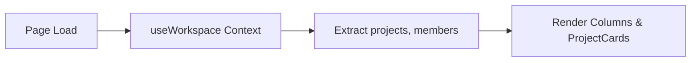
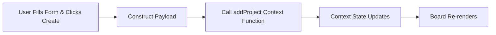
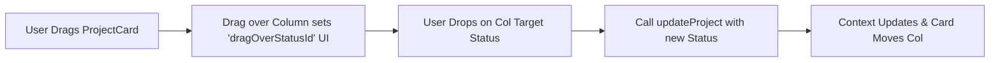
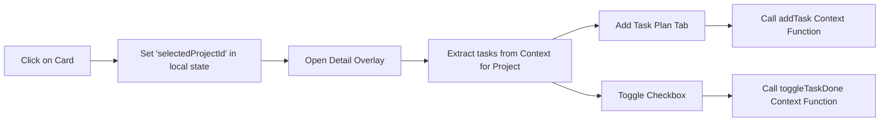

# Projects Module Analysis - UI Elements and Data Flow

Based on the structure of your provided projects module code (e:\work\Automation\CRM\Tagverse_crm\Tagverse_crm\src\app\(crm)\projects), here is a breakdown of the elements and data flows present in the page:

## UI Elements Analysis

### 1. Top Section (Header & Actions) `page.tsx`
- **Title Area**: "Project Management" with a descriptive subtitle.
- **Search Bar**: Input field to filter projects (local state).
- **Primary Action**: '+ Create Project' button, which opens the creation modal overlay.

### 2. Kanban Board (Main View) `ProjectBoard.tsx`
- **Columns**: Fixed workflow stages (Kick-off, Planning, Implementation, Review, Closing) mapped to project statuses.
- **Project Cards**: Draggable UI components displaying:
  - Emoji icon and Project Name.
  - Circular SVG Progress Ring (dynamically calculated dashoffset).
  - Due date and overlapping assignee avatars.
- **Drag & Drop Functionality**: HTML5 drag-and-drop handles moving projects between columns, changing visual state on hover.

### 3. Create Project Modal `page.tsx`
- **Form Inputs**: Project Name, Color Theme (native color picker), Est Budget, and Assign Members.
- **Member Dropdown**: A custom multi-select dropdown that allows searching existing members or dynamically adding a new "local" member on the fly.

### 4. Project Detail Overlay (Modal View) `ProjectDetailOverlay.tsx`
A full-screen modal split into a Left Sidebar and Right Tabbed Panel.
- **Left Sidebar (Summary)**:
  - Core info: Name, Status, Emoji.
  - Linear Progress bar (visual representation of `project.progress`).
  - Metadata: Start Date, Due Date, Time Tracked.
  - Team section (pill badges of assignees).
  - Linked Entities (e.g., Linked Deal badge).
- **Right Panel (Tabs)**:
  - **Plan**: Lists tasks categorized by phase in a table format (Done checkbox, Subject, Assignee, Due Date, Priority badge). Includes an inline text input to "+ Add Task" for each phase.
  - **Files**: Drag-and-drop upload zone, Google Drive connect button, and sub-filters (All, Deal files, Project files).
  - **Notes**: An owner bar, a text area to add notes, sub-filters, and a chronological list of note cards.
  - **Emails**: Placeholder input area and sub-filters.
  - **Documents**: Sub-tabs for "Documents" and "Templates", with upload and cloud storage integration buttons.

## Data Flow Diagrams (Mermaid)

### 1. Initialization & Render

### 2. Create New Project (Modal)

### 3. Drag & Drop Status Update (Kanban)

### 4. Project Details & Task Management

