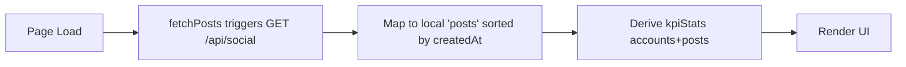
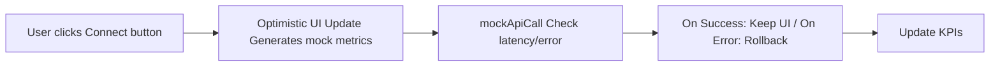
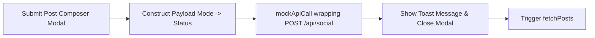
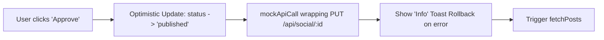
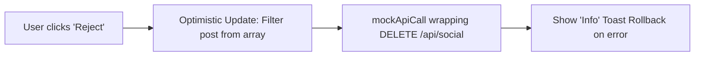

# Social Module Analysis - UI Elements and Data Flow

Based on the structure of your provided social module code (e:\work\Automation\CRM\Tagverse_crm\Tagverse_crm\src\app\(crm)\social\page.tsx), here is a breakdown of the elements and data flows present in the page:

## UI Elements Analysis

### 1. Top Section (Header)
- **Title Area**: "SocialPulse" with 'Enterprise Creator Suite' badge and subtitle.
- **API Testing Tools**: Developer controls to force simulated API failures and adjust artificial latency (0ms, 500ms, 1500ms).
- **Primary Action**: '+ Create Post' button opening the post composer modal.

### 2. KPI Cards
A grid of 4 key performance indicators, with loading skeletons.
- **Total Followers**: Sum across connected accounts, with an upward trend indicator.
- **Posts This Month**: Sum across connected accounts, compared against a target goal.
- **Avg Engagement**: Averaged percentage across connected accounts.
- **Pending Approval**: Count of posts awaiting review, with an animated 'Action Required' badge if > 0.

### 3. Main Content Split Layout
- **Left Column: Accounts & History**
  - **Accounts Grid**: Cards for supported platforms (LinkedIn, Instagram, Twitter/X).
    - *If Connected*: Displays Followers, Engagement, Impressions, Posts (Mo), and an animated Follower Goal Progress bar. Includes a button to post specifically to this channel.
    - *If Disconnected*: Displays a placeholder prompt to "Integrate" and "Link Account".
  - **Latest Shared Posts**: Chronological list of already published/scheduled posts. Displays platform icon, text content, timestamp, and a "Queue Confirmed" status.
- **Right Column: Pending Approvals Queue**
  - A sticky vertical list showing draft/scheduled posts awaiting review.
  - **Queue Cards**: Shows platform badge, creation time, full content snippet, and scheduled time. Features explicit 'Reject' (X) and 'Approve' (Check) action buttons.

### 4. Modals & Notifications
- **Create New Post Modal**:
  - Target Platform selector (visual toggle buttons).
  - Post Content textarea.
  - Publish Mode toggle ('Publish Immediately' vs 'Queue for Approval').
  - Date and Time inputs (conditionally rendered if scheduling).
- **Floating Toast Alerts**: Top-right stacked notifications indicating success, info, or errors (e.g., API simulation failures), lasting 4 seconds.

## Data Flow Diagrams (Mermaid)

### 1. Initialization & KPI Aggregation

### 2. Connect / Disconnect Platform

### 3. Create New Post

### 4. Approve Post (From Pending Queue)

### 5. Reject Post (From Pending Queue)

