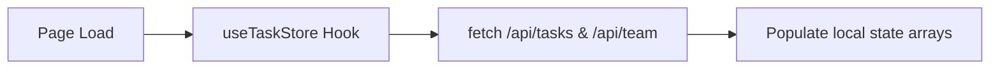
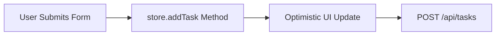
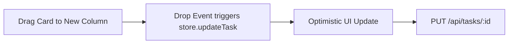
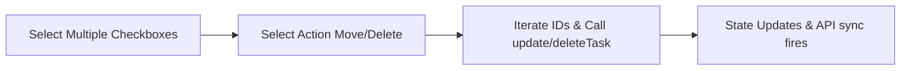

# Tasks Module Analysis - UI Elements and Data Flow

Based on the structure of your provided tasks module code (e:\work\Automation\CRM\Tagverse_crm\Tagverse_crm\src\app\(crm)\tasks), here is a breakdown of the elements and data flows present in the page:

## UI Elements Analysis

### 1. Top Toolbar & Global Controls
- **View Switcher**: Buttons to toggle between Kanban, Dashboard, List, Table, and Calendar views.
- **Actions**: Search bar and '+ New Task' button.
- **Filters**: Dropdowns for Owner, Priority, Tag, and Sort order.
- **Bulk Actions Strip**: Appears when multiple tasks are selected in List/Table views, allowing for bulk status change or deletion.

### 2. Kanban Board View
- **Columns**: Rendered based on customizable status strings.
- **Cards**: Draggable task cards showing title, description snippet, priority tag, labels, due date, and assignee avatar.
- **Drag & Drop**: HTML5 API handling drag start/over/drop to move tasks between columns.
- **Customization**: Ability to add new columns or delete empty ones.

### 3. List & Table Views
- **Data Grid**: Displays tasks in rows with selectable checkboxes.
- **Inline Editing**: Dropdowns for Status and Priority, date picker for Due Date.
- **Row Actions**: Delete button per row.

### 4. Calendar View
- **Month/Day Views**: Toggleable layout to show tasks across a whole month or focused on a single day's schedule.
- **Visuals**: Distinct color bars indicating task priority density.
- **Interaction**: Clicking a day opens scheduling, clicking a task opens details.

### 5. Dashboard View (Analytics)
- **Draggable Widgets**: Re-arrangeable cards for different metrics.
- **Overview Widget**: KPI counts (Total, Completed, Active Pipeline, High Priority).
- **Status Chart**: Custom SVG bar chart for task statuses.
- **Priority Donut Chart**: Custom SVG donut for priority distribution.
- **Team Activity**: Progress bars showing task allocation per assignee.

### 6. Task Details Modals
- **TaskViewModal**: Slide-over or centered modal displaying full task details (Description, Linked Deal, Subtasks, Comments).
- **NewTaskModal / Edit Mode**: Form for creating or updating tasks (Title, Status, Assignee, Priority, Due Date).
- **DeleteConfirmModal**: Safeguard modal before deleting a task.

## Data Flow Diagrams (Mermaid)

### 1. Initialization & State Management

### 2. Create New Task

### 3. Drag & Drop Status Update (Kanban)

### 4. Bulk Actions (List/Table Views)

