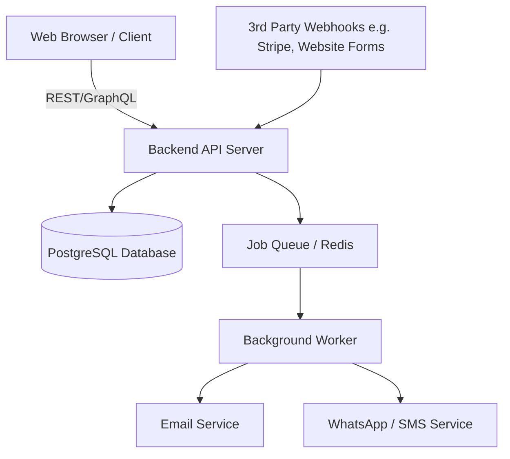
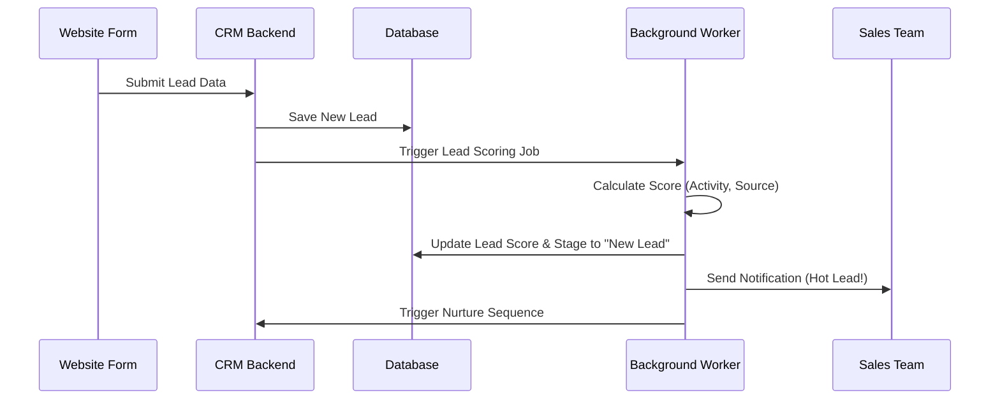
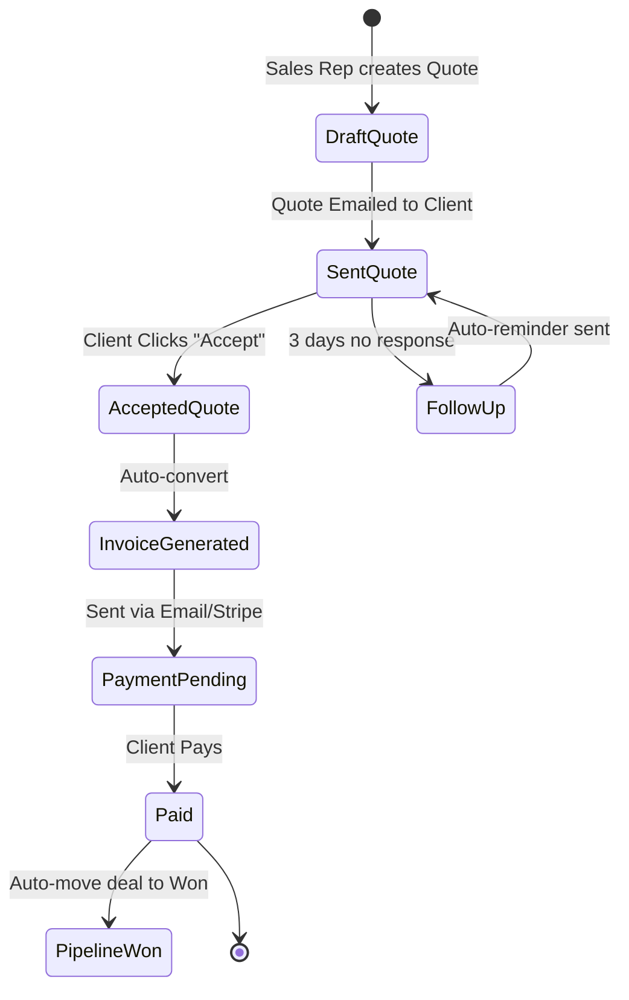
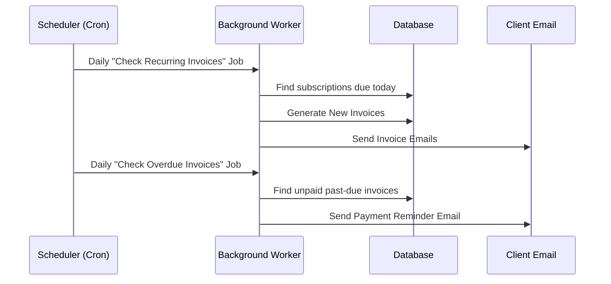
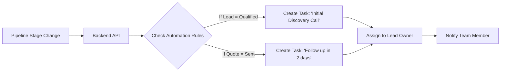

# Tagverse CRM - Automation Architecture Workflows

Here are the detailed visual workflows for the core automation systems in the CRM, showing how data flows between different components.

## 1. Core Architecture Overview

## 2. Sales & Pipeline Flow (Lead Capture & Scoring)

## 3. Quotation to Payment Auto-Conversion Flow

## 4. Invoicing & Recurring Billing Flow

## 5. Task Management Automation

